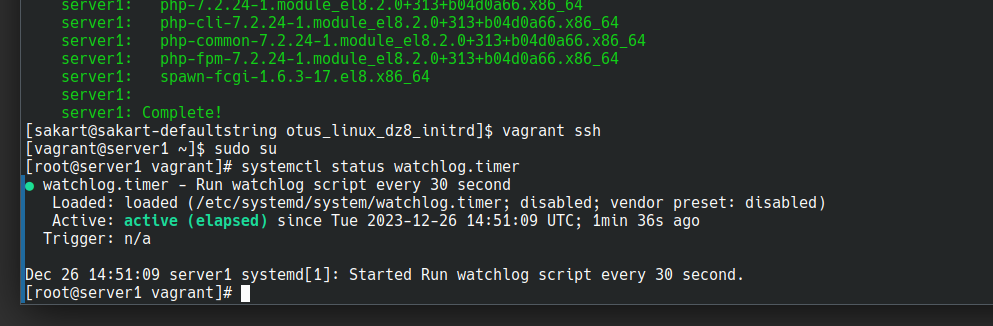
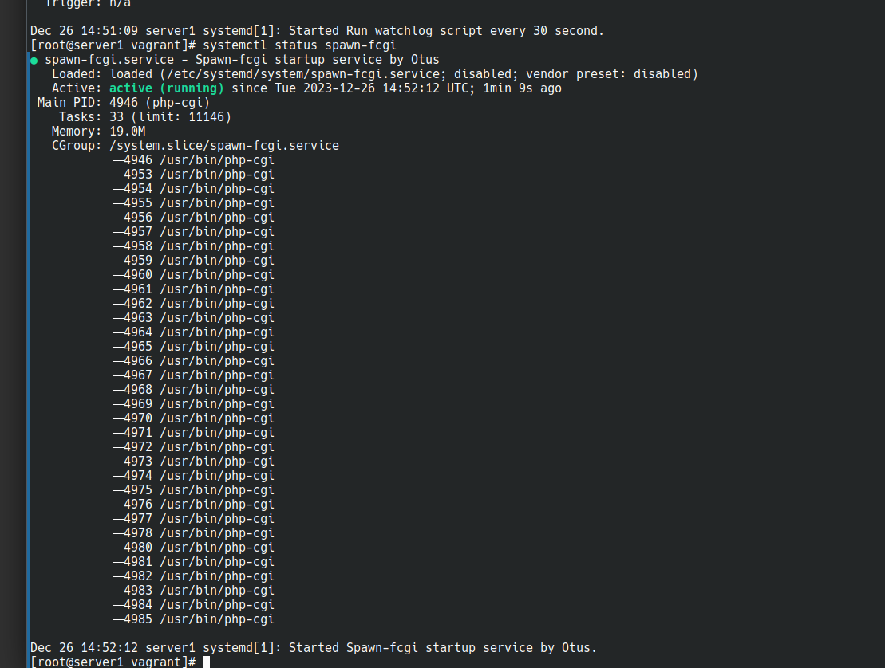
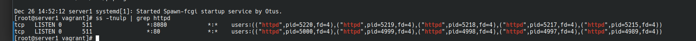

# otus_linux_dz8_initrd

Цель задания

1. Написать service, который будет раз в 30 секунд мониторить лог на предмет наличия ключевого слова (файл лога и ключевое слово должны задаваться в /etc/sysconfig или в /etc/default).
2. Установить spawn-fcgi и переписать init-скрипт на unit-файл (имя service должно называться так же: spawn-fcgi).
3. Дополнить unit-файл httpd (он же apache2) возможностью запустить несколько инстансов сервера с разными конфигурационными файлами.

Выполнение:

Написан Vagrant файл, который устанавливает виртуальную машину и запускает bash скрипт.

!

Проверка исполнения скрипта.

1. Запускаем vagrant

2. Заходим на машину и проверяем что watchlog.timer запущен

3. Проверяем spawn-fcgi

   
4. и в конце проверяем что httpd запущен в 2 экземплярах и слушиют 80 и 8080 порты.

   
